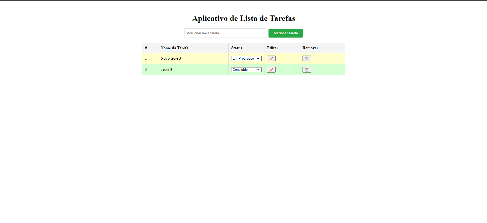

# Aplicativo de Lista de Tarefas

[](https://opensource.org/licenses/MIT)

Este projeto é um aplicativo de lista de tarefas (Todo List) construído utilizando React e Vite. O objetivo do aplicativo é permitir que os usuários gerenciem suas tarefas diárias, adicionando, editando, excluindo e marcando tarefas como concluídas.

## Funcionalidades

- Adição de novas tarefas.
- Edição de tarefas existentes com confirmação.
- Exclusão de tarefas com confirmação.
- Alteração do status da tarefa (A Fazer, Em Progresso, Concluído).
- Destaque visual para tarefas em progresso e concluídas.
- Armazenamento de tarefas no `localStorage` para persistência entre sessões.

## Tecnologias Utilizadas

- React para a construção da interface do usuário.
- Vite para empacotamento e desenvolvimento rápido.
- CSS para estilização.
- JavaScript para a lógica do aplicativo.
- GitHub para versionamento e hospedagem do código.

## Instalação

Para instalar e executar este projeto localmente, siga estas etapas:

1. Clone o repositório:

    ```bash
    git clone https://github.com/reginaldoassuncao/todo-list.git
    ```

2. Navegue até o diretório do projeto:

    ```bash
    cd todo-list
    ```

3. Instale as dependências do projeto:

    ```bash
    npm install
    ```

4. Execute o projeto:

    ```bash
    npm run dev
    ```

5. Abra o navegador e acesse:

    ```
    http://localhost:5173
    ```

## Uso

Para usar o aplicativo, siga as instruções abaixo:

1. Para adicionar uma nova tarefa, insira o nome da tarefa no campo de entrada e clique no botão "Adicionar Tarefa".
2. Para editar uma tarefa, clique no ícone de lápis ao lado da tarefa e confirme a edição no modal.
3. Para excluir uma tarefa, clique no ícone de lixeira ao lado da tarefa e confirme a exclusão.
4. Para alterar o status de uma tarefa, use o menu suspenso na coluna "Status".

## Contribuição

Contribuições para o projeto são bem-vindas! Para contribuir, por favor, siga estas etapas:

1. Fork o repositório.
2. Crie uma nova branch com um nome descritivo para a nova funcionalidade ou correção.
3. Faça suas alterações.
4. Envie um pull request detalhando as mudanças propostas.

## Licença

Este projeto está licenciado sob a Licença MIT - veja o arquivo [LICENSE](LICENSE) para detalhes.

## Deploy

A aplicação está disponível para teste em [https://github.com/reginaldoassuncao/todo-list](https://github.com/reginaldoassuncao/todo-list)

## Captura de Tela

### Tela do Aplicativo

